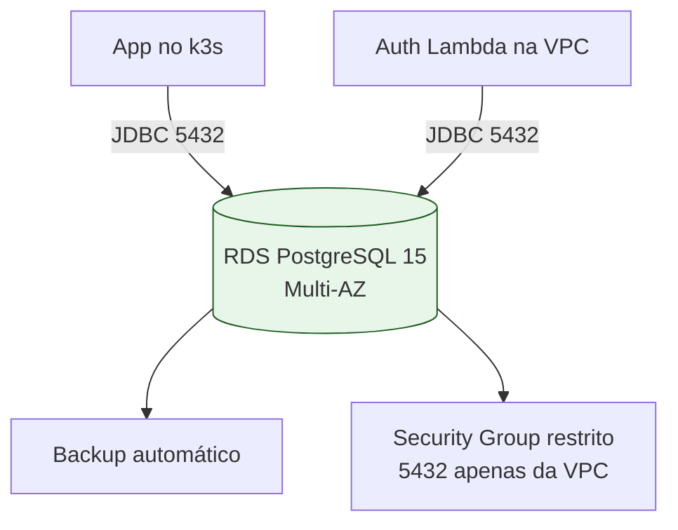

# tc-oficina-infra-db

Infraestrutura como código (Terraform) do banco de dados gerenciado (RDS PostgreSQL) da aplicação de oficina mecânica **tc-oficina**.

## Escopo

Este repositório provisiona e gerencia o **Amazon RDS PostgreSQL**:

- Instância RDS PostgreSQL 15 (gerenciada pela AWS)
- Multi-AZ (alta disponibilidade)
- Backup automático com retenção configurável
- Storage criptografado (gp3)
- Subnet group privado (dentro da VPC do cluster k3s)
- Security group com acesso restrito (5432 apenas para CIDRs da VPC)

> A infraestrutura do cluster Kubernetes vive no repositório [tc-oficina-infra-k8s](../tc-oficina-infra-k8s).

## Estrutura

```
tc-oficina-infra-db/
├── terraform/
│   ├── provider.tf     # Provider AWS + datasources da VPC
│   ├── main.tf         # Subnet group, security group, RDS instance
│   ├── variables.tf    # Variáveis (senha, classe, storage, backup)
│   └── outputs.tf      # Endpoint e credenciais do banco
└── .github/workflows/  # CI/CD (Terraform)
```

## Tecnologias

- Terraform 1.6+ (AWS provider ~> 5.0)
- Amazon RDS PostgreSQL 15
- GitHub Actions (CI/CD)

## Pré-requisitos

- VPC do `tc-oficina-infra-k8s` provisionada (subnets privadas com tag `Name = tc-oficina-vpc`)
- Secrets no GitHub: `AWS_ACCESS_KEY_ID`, `AWS_SECRET_ACCESS_KEY` e var `AWS_REGION`
- Senha do banco informada via `DB_PASSWORD` (secret shareada com app e lambda)

## Como executar

```bash
cd terraform

# Criar terraform.tfvars com db_password
echo 'db_password = "sua-senha-forte"' > terraform.tfvars

terraform init
terraform validate
terraform plan -out=tfplan
terraform apply tfplan
```

## CI/CD

O workflow em `.github/workflows/ci.yml`:

1. Executa `terraform fmt`, `init` e `validate`
2. Gera `plan` na branch `homologacao`
3. Executa `apply` automático na branch `main`

## Diagrama da Arquitetura


